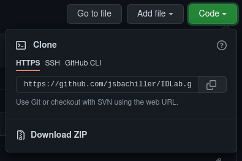

# Git version control and RStudio
### Javier Sánchez Bachiller
##### Higher School of Economics

*jsbachiller.work@gmail.com*

---

# What is version control?

- Way to keep track of the changes in your code and always be able to go back ot previous states

## What is Git?

- The most popular version control system for software developing
- The biggest host for git is currently [GitHub](https://github.com/)
- Projects are organized in `repositories`

---

# Git and GitHub

- It allows us to keep our code safe from any problems in our laptop
- Changes are automatically noted down and the newly outdated version of the code, archived
- Any coding decision that we took can be easily reverted
- Great for collaborating

---

# Create a repository

To create a repository (AKA *repo*) in GitHub, just click on the green button at the upper-left corner of your main page. It should prompt you for a name and to choose some options:

- *Public* makes the repo visible to anyone in the internet, *private* will make sure only your collaborators can see it. No one can edit anything, though, unless you give them specific permission.
- Include some additional template files. We will chose both the `README` and the `.gitignore` files

---

# Get access to a repo locally

In order to work with a repo comfortably you need to create a copy of it in your own machine. To do that

1. Make sure git client is installed in your laptop
2. Copy the link of the desired repo by deploying the menu under the green button `Code` in the main GitHub page of the repo 

3. In RStudio, go to `File > New Project... > Version Control > Git`, paste the link there and create the project

---

# Manage locally a repo

Now you have a local copy under the specified directory of the repository sitting on github, you can work on any of the files as you would do normally!

Once you want to commit (that is, to make a *checkpoint* in the code to where you can come back later), go to the `git` tab in the right-upper corner in RStudio and select the button `commit`. There, you select which files to commit and the description of what has changed.